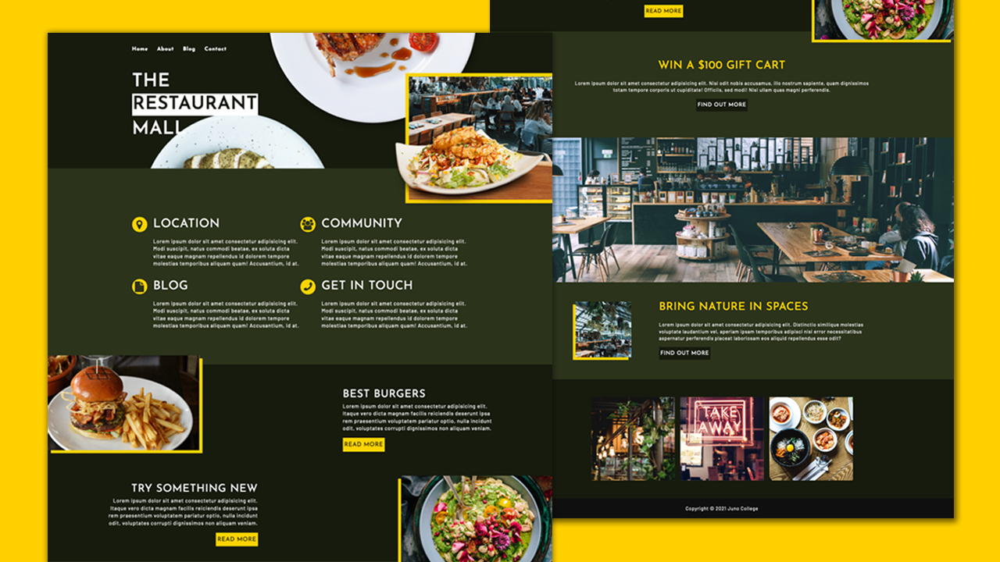

Juno College Web Development Bootcamp - Project 1

## Table of contents

- [Overview](#overview)
  - [Objective](#the-challenge)
  - [Screenshot](#screenshot)
- [My process](#my-process)
  - [Built with](#built-with)
  - [What I learned](#what-i-learned)
- [Author](#author)

## Overview

### Objective

- To convert a design into a multi-page, functional, responsive website.

### Screenshot

### Links

- Solution URL: [Code](https://github.com/cleunggit/project1)
- Live Site URL: [Preview](https://cleunggit.github.io/project1)

## My process

### Built with

- Semantic HTML5 markup
- CSS custom properties
- Flexbox
- SCSS

### What I learned

## Author

- Frontend Mentor - [@cleunggit](https://www.frontendmentor.io/profile/cleunggit)
- Twitter - [@CodeLikeChris](https://www.twitter.com/CodeLikeChris)